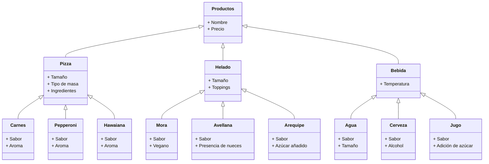

# Reto dos
**Instrucción:** Elija un problema de la vida real (sistema de gestión de biblioteca, negocio de compra-venta, automóvil, etc) que se pueda modelar a través de objetos y clases. Plantee las relaciones de clases, composiciones, propiedades y comportamientos del sistema en uno mas diagramas tipo UML.

**Problema de la vida real**: Para este reto se tuvo como referencia una cafetería de comida rápida y las relaciones y comportamientos que existen entre el comprador, el vendedor y los distintos productos.

**Relación entre productos**

**Relación cliente-vendedor**

    
